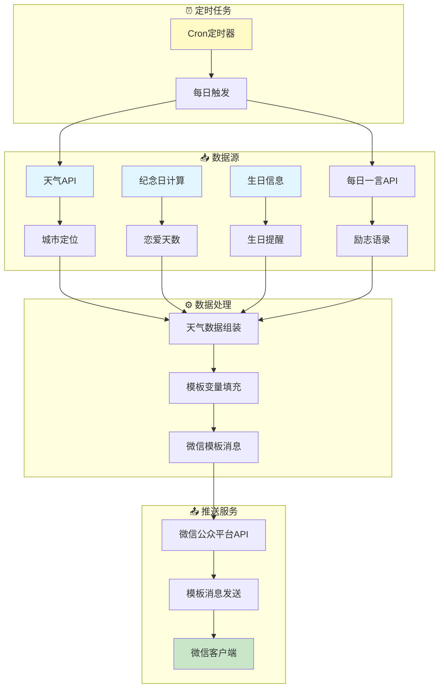
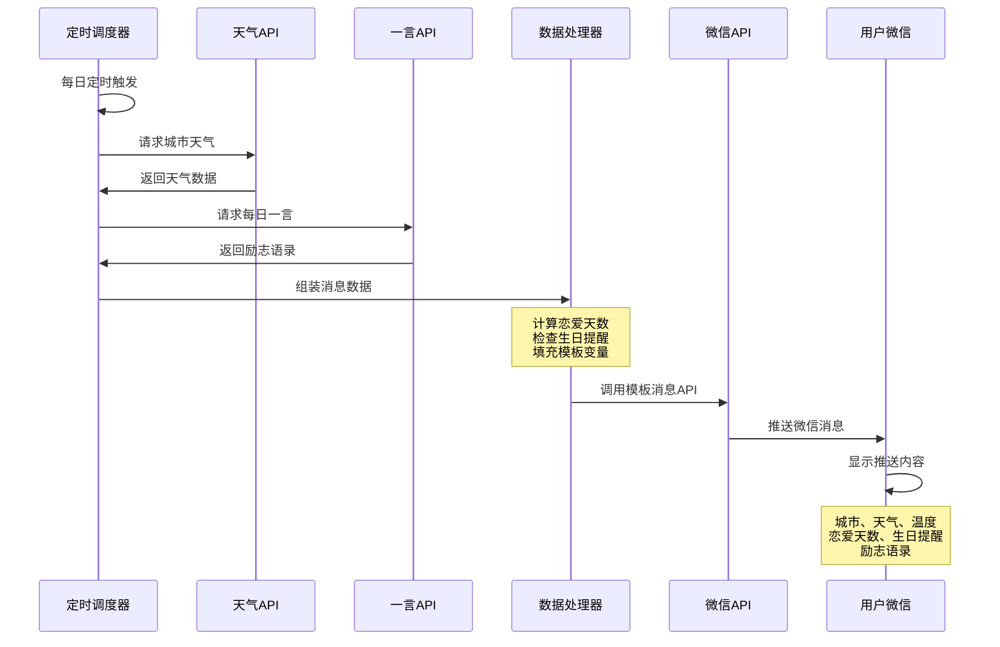
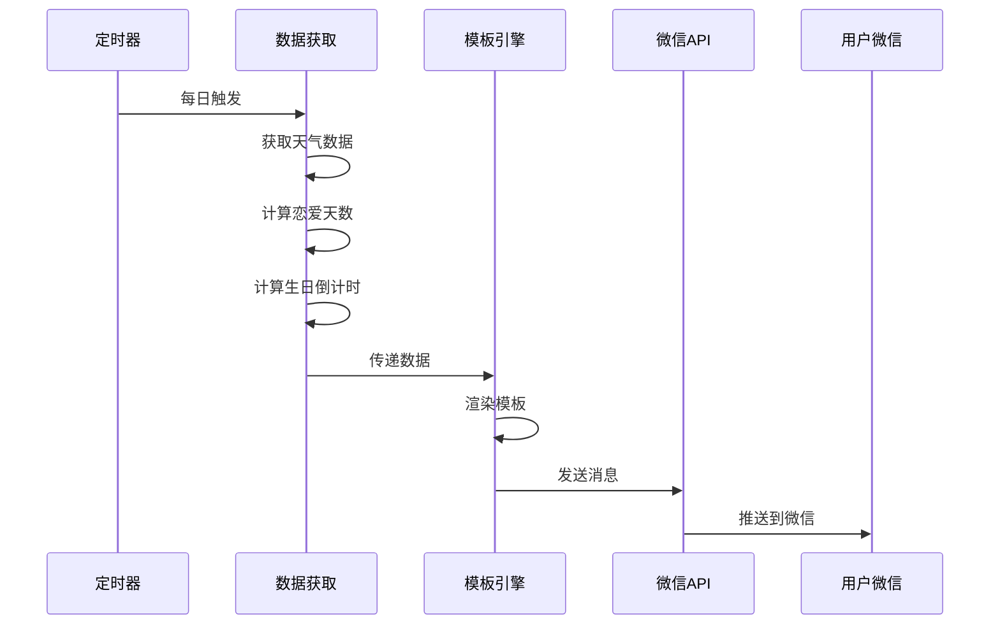

# 🌤️ fork-githubDayMessage - 微信天气推送


## 📖 项目简介

fork-githubDayMessage是微信天气推送工具,通过微信公众平台API发送每日天气、纪念日、励志语录等模板消息到微信客户端。

## 📦 项目来源

- **原项目**: 未知(待确认)
- **原作者**: 未知
- **开源协议**: 未明确标注(需查看原项目)
- **Fork时间**: 2024年

## 🔧 二次开发内容

本项目为原项目的学习研究版本,主要用于:
- 学习微信公众平台API的使用
- 研究定时任务和消息推送技术
- 了解第三方API的集成方法

## ⚠️ 免责声明

本项目仅供学习研究使用,请勿用于商业用途或非法用途。使用本项目所产生的一切后果由使用者自行承担。

## 系统架构 | System Architecture



## 消息推送流程 | Message Flow



## 模板变量说明 | Template Variables

```mermaid
mindmap
  root((消息模板))
    基础信息
      日期
      城市
    天气数据
      天气状况
      气温
      风向
    纪念日
      恋爱天数
      生日1
      生日2
    每日一言
      英文语录
      中文翻译

## 📊 系统架构

```mermaid
flowchart TB
    subgraph Scheduler["⏰ 定时调度"]
        Cron["定时任务<br/>每日触发"]
    end
    
    subgraph DataFetcher["📡 数据获取"]
        Weather["天气API<br/>获取天气数据"]
        Love["恋爱天数<br/>计算天数"]
        Birthday["生日提醒<br/>生日倒计时"]
    end
    
    subgraph Template["📝 模板引擎"]
        Engine["模板渲染"]
        Data["数据填充"]
    end
    
    subgraph WeChat["💬 微信推送"]
        API["微信模板消息API"]
        User["用户接收"]
    end
    
    Cron --> DataFetcher
    DataFetcher --> Template
    Template --> WeChat
    
    Weather --> Engine
    Love --> Engine
    Birthday --> Engine
    Engine --> Data
    Data --> API
    API --> User
    
    classDef schedulerStyle fill:#fff3e0,stroke:#f57c00,stroke-width:2px
    classDef fetchStyle fill:#e3f2fd,stroke:#1565c0,stroke-width:2px
    classDef templateStyle fill:#f3e5f5,stroke:#7b1fa2,stroke-width:2px
    classDef wechatStyle fill:#e8f5e9,stroke:#388e3c,stroke-width:2px
    
    class Cron schedulerStyle
    class Weather,Love,Birthday fetchStyle
    class Engine,Data templateStyle
    class API,User wechatStyle
```

## 🔄 推送流程



{{date.DATA}} 

城市：{{region.DATA}} 

天气：{{weather.DATA}} 
气温：{{temp.DATA}} 
风向：{{wind_dir.DATA}} 
今天是我们恋爱的第{{love_day.DATA}}天 


{{birthday1.DATA}}

{{birthday2.DATA}}

{{note_en.DATA}} {{note_ch.DATA}}
